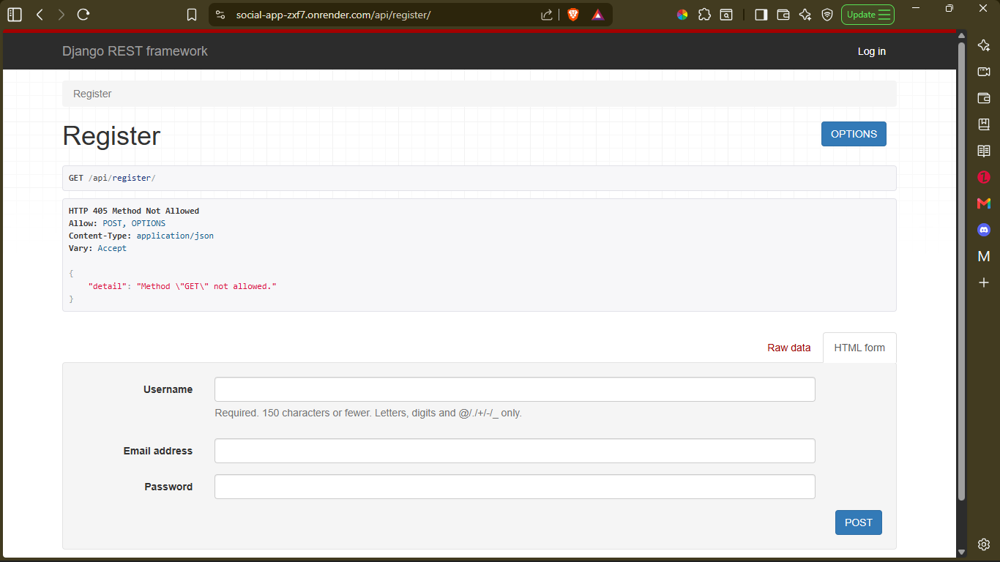
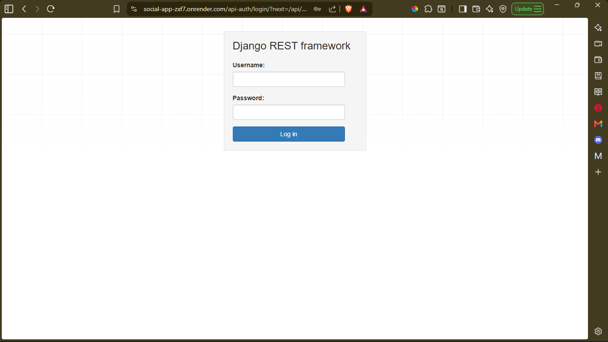
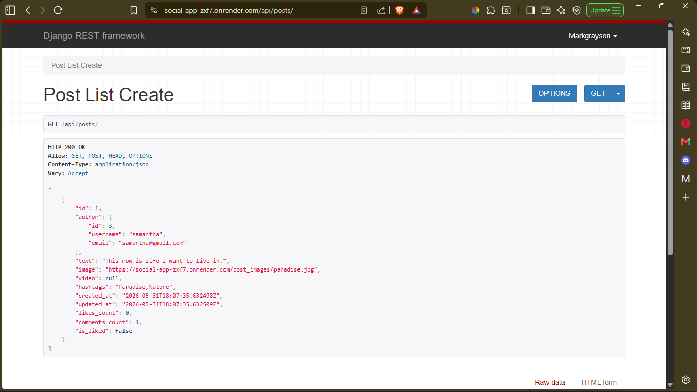

# Social Media App

## A. Contributor

* **Albert Junior Quarshie**

---

## B. Overview

* **Social App** is a web application built using Django that allows users to connect, share posts, interact with other users, and discover new content.

* Users can create accounts, manage their profiles, create posts, comment on posts, like content, and follow other users.

* The application provides a personalized news feed based on the users and content each person follows.

---

## C. Requirements

The following software should be installed before running the project:

1. Python 3.14

2. Django (Latest Version)

3. PostgreSQL, MySQL, or SQLite

---

## D. Installation

### 1. Clone the Repository

```bash
git clone https://github.com/AlbertQuarshie/social_app.git
cd social_app
```

### 2. Create a Virtual Environment

```bash
# Windows
python -m venv my_env
my_env\Scripts\activate

# Linux/macOS
python3 -m venv my_env
source my_env/bin/activate
```

### 3. Install Dependencies

```bash
pip install requirements.txt
```

### 4. Configure Database

Update the database settings inside:

```bash
settings.py
```

Choose PostgreSQL, MySQL, or SQLite depending on your environment.

- Note this project is hardcoded with Postgresql so change the settings whenever a different database is to be used.

### 5. Run Migrations

```bash
python manage.py makemigrations
python manage.py migrate
```

### 6. Start the Server

```bash
python manage.py runserver
```

---

## E. Usage

### 1. User Registration

* Create a new account using the registration page.

### 2. Login

* Sign in using registered credentials.

### 3. Manage Profile

* Update profile information and upload a profile picture.

### 4. Create Posts

* Share text, images, or videos with other users.

### 5. Interact with Content

* Like, comment, and follow other users.

### 6. Explore Users

* Search for users and discover trending content.

---

## F. Features

### 1. User Authentication

* Secure registration and login system.
* Passwords stored using hashing.

### 2. User Profiles

* Profile management.
* Display posts, followers, and following lists.

### 3. News Feed

* Personalized feed showing posts from followed users.

### 4. Posts Management

* Create, edit, and delete posts.
* Support for hashtags.

### 5. Comments and Likes

* Comment on posts.
* Like or unlike posts and comments.

### 6. User Discovery

* Search users.
* Follow and unfollow accounts.

---

## G. API Endpoints

### Profile Endpoints

```http
GET    /api/profiles/{user_id}/
PUT    /api/profiles/{user_id}/
```

### Post Endpoints

```http
GET    /api/posts/
GET    /api/posts/{post_id}/
POST   /api/posts/
PUT    /api/posts/{post_id}/
DELETE /api/posts/{post_id}/
```

### Comment Endpoints

```http
GET    /api/posts/{post_id}/comments/
POST   /api/posts/{post_id}/comments/
PUT    /api/comments/{comment_id}/
DELETE /api/comments/{comment_id}/
```

### Like Endpoints

```http
POST   /api/posts/{post_id}/like/
POST   /api/comments/{comment_id}/like/
DELETE /api/posts/{post_id}/like/
DELETE /api/comments/{comment_id}/like/
```

### Follow Endpoints

```http
POST   /api/users/{user_id}/follow/
DELETE /api/users/{user_id}/follow/
```

### Search Endpoints

```http
GET /api/search/users/?query={search_query}
```

---

## H. Tech Stack

| Layer                | Technology                  |
| -------------------- | --------------------------- |
| Programming Language | Python                      |
| Framework            | Django                      |
| API Framework        | Django REST Framework       |
| Database             | PostgreSQL                  |
| Authentication       | Django Authentication       |


---

## I. Screenshots
1. Registration Page Endpoint


2. Login Page Endpoint


3. Feed Post Endpoint

